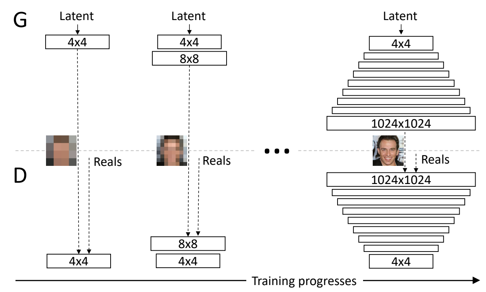

### ProGAN Implementation using Pytorch ###

A simple implementation of the [Progressive Growing of GANs](https://arxiv.org/pdf/1710.10196.pdf) paper, entirely in Pytorch.

This work is by far not the best implementation but is ofcourse easy to follow and work out your own version. 

> A huge shout-out to **Animesh Karnewar** for his amazing implementation [(link)](https://github.com/akanimax/pro_gan_pytorch) of ProGAN from where I took a lot of inspirations.

### Architecture ###

*_Image is taken from the [Paperspace Blog](https://blog.paperspace.com/progan/) which in turn was taken from the original paper_.*

### Dependencies ###

To run the repository the following dependencies are necessary. 
- torch 1.13.1
- torchvision 0.14.1
- glob
- tqdm
- pillow 9.4.0

### Usage ###

To rerun my experiments do the following.
- Clone the repo and extract it.
- Download the CelebA dataset from [Kaggle](https://www.kaggle.com/datasets/jessicali9530/celeba-dataset/data).
- Store it in such a way that all the images are in `img_align_celeba/img_align_celeba` directory.
- Run the `train.py` file using `python train.py`.
- I have also provided a batch script file for training, `train.sh`, in case anyone wants to use it. Please update it to properly use it.

Please properly check the hyperparameters in the `train.py` file and change it to suit your needs. 

To use it for a new dataset, please change the `data.py` file and make correct imports of the new dataset instance in the `train.py` file.

> Side Note: I didn't use Multi-gpu in this work. If you want to update it to multi-gpu, you have to work your own implementations. :grin:

### Results ###

To be uploaded...

### Remarks ###

Launch a new issue in case you find any bugs or having some trouble understanding any bit. Hope this helps! :blush: